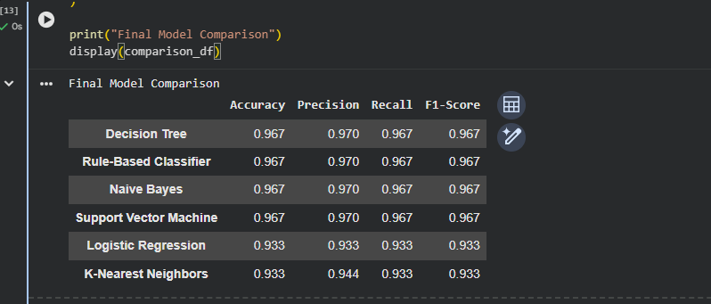
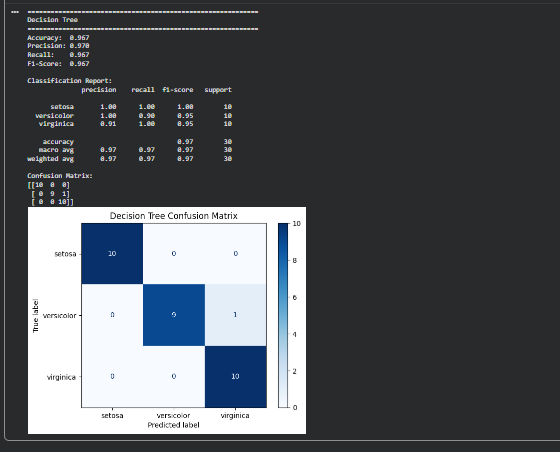
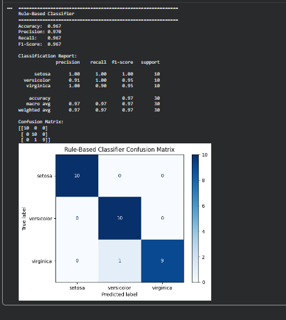
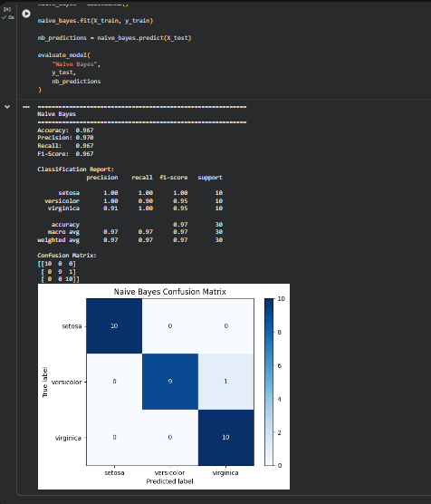
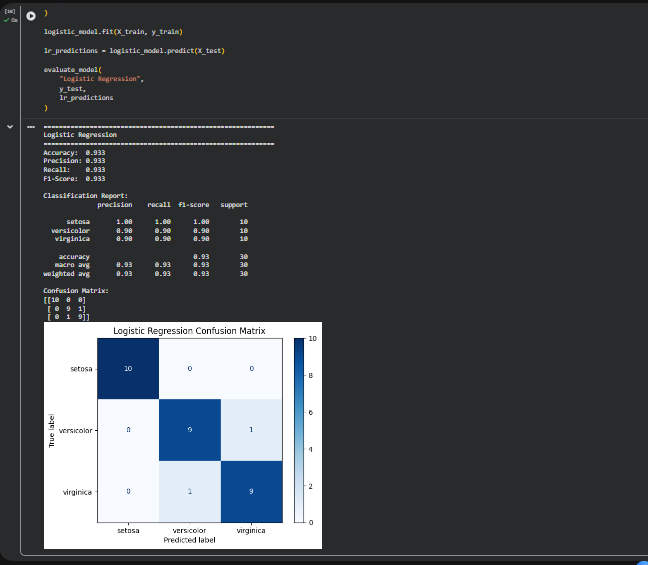
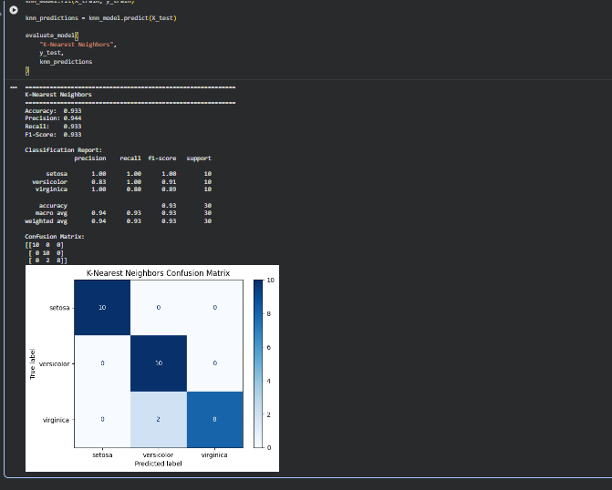
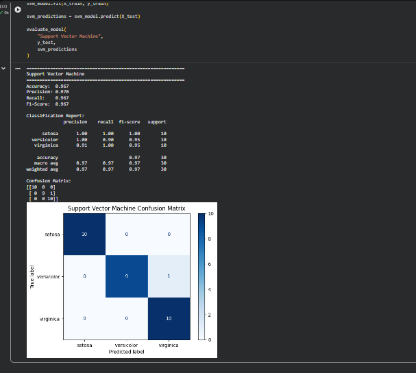

# Iris Classification Model Comparison

## Project Overview

This machine learning project compares six classification approaches for predicting Iris flower species based on physical flower measurements.

The project uses the classic Iris dataset and evaluates rule-based, probabilistic, distance-based, and optimization-based classification techniques. Each model is trained and tested using the same dataset split so that performance can be compared consistently.

## Business Problem

Classification models are used to assign observations to predefined categories based on known characteristics. In this project, the goal is to determine whether a flower belongs to the Setosa, Versicolor, or Virginica species using measurements of its sepals and petals.

## Dataset

The Iris dataset contains 150 flower observations divided evenly among three species:

- Setosa
- Versicolor
- Virginica

Each observation contains four numerical features:

- Sepal length
- Sepal width
- Petal length
- Petal width

The dataset contains 50 observations for each species.

## Models Evaluated

Six classification approaches were developed and compared:

1. Decision Tree
2. Custom Rule-Based Classifier
3. Gaussian Naive Bayes
4. Logistic Regression
5. K-Nearest Neighbors
6. Support Vector Machine

## Data Preparation

The dataset was divided into:

- 80% training data
- 20% testing data

A stratified train-test split was used to maintain equal representation of each flower species.

StandardScaler was applied to Logistic Regression, K-Nearest Neighbors, and Support Vector Machine.

## Evaluation Metrics

Each model was evaluated using:

- Accuracy
- Confusion Matrix
- Precision
- Recall
- F1-score

## Model Performance

| Model | Accuracy | Precision | Recall | F1-Score |
|---|---:|---:|---:|---:|
| Decision Tree | 96.67% | 96.97% | 96.67% | 96.66% |
| Rule-Based Classifier | 96.67% | 96.97% | 96.67% | 96.66% |
| Gaussian Naive Bayes | 96.67% | 96.97% | 96.67% | 96.66% |
| Logistic Regression | 93.33% | 93.33% | 93.33% | 93.33% |
| K-Nearest Neighbors | 93.33% | 94.44% | 93.33% | 93.27% |
| Support Vector Machine | 96.67% | 96.97% | 96.67% | 96.66% |

## Model Accuracy Chart

## Model Results

### Overall Model Comparison

### Decision Tree

### Rule-Based Classifier

### Gaussian Naive Bayes

### Logistic Regression

### K-Nearest Neighbors

### Support Vector Machine

## Key Findings

Decision Tree, Rule-Based Classification, Gaussian Naive Bayes, and Support Vector Machine produced the highest accuracy at approximately 96.7%.

Setosa was the easiest species for the models to classify because its measurements are well separated from the other two species.

Most classification errors occurred between Versicolor and Virginica because their measurements overlap more closely.

## Technologies Used

- Python
- NumPy
- pandas
- scikit-learn
- Jupyter Notebook / Google Colab
- Git
- GitHub

## Skills Demonstrated

- Machine learning classification
- Data preprocessing
- Train-test splitting
- Feature scaling
- Decision trees
- Naive Bayes
- Logistic regression
- K-Nearest Neighbors
- Support Vector Machines
- Confusion matrices
- Precision and recall
- F1-score evaluation
- Comparative model analysis
- Python programming
- Technical documentation

## Future Improvements

Future versions of this project could include hyperparameter tuning, cross-validation, visualizations, feature importance analysis, and additional classification algorithms.

## Author

**Danielle Walker**

Computer Science | Salesforce Administration | CRM & Technical Support | Data Analysis
